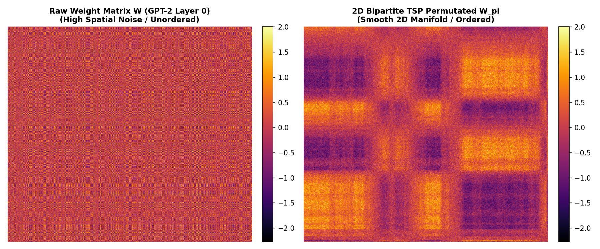
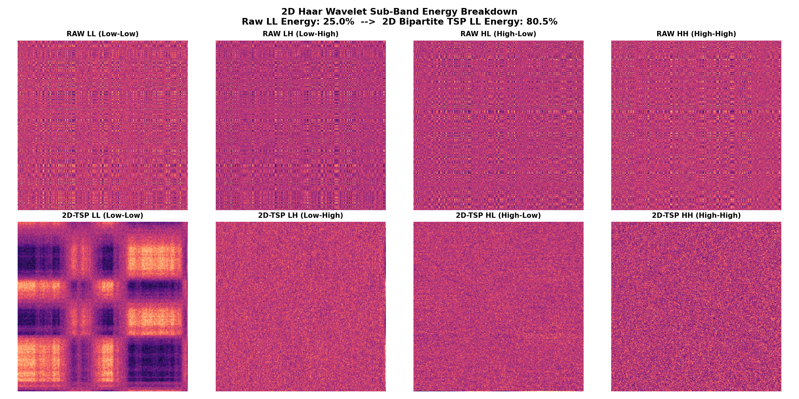

# `spec-rama`: Permutated Spectral PEFT Framework

`spec-rama` is a parameter-efficient fine-tuning (PEFT) framework that combines **Weight Permutation (Greedy TSP / Bipartite)** with **Spectral Core Adaptation (DCT, FWHT, DWT Wavelet)** and **RAMA Multiplicative-Additive Modulation**.

---

## 🏆 GPT-2 Small NF4 PEFT Benchmark

See full documentation in [docs/findings_spec_rama_v12.md](./docs/findings_spec_rama_v12.md) and [docs/findings_spec_rama_v11.md](./docs/findings_spec_rama_v11.md).

| Experimental Arm / Strategy | Base Format | Adapter Size | TEST PPL | Bits/Token (bpt) | $\Delta \text{bpt}$ vs Native FP32 | $\Delta \text{bpt}$ vs Adapted FP32 | Model Status |
| :--- | :---: | :---: | :---: | :---: | :---: | :---: | :--- |
| **1. GPT-2 FP32 Native (Zero-Shot)** | 32-bit FP32 | 0.0 KB | **46.18** | **5.529 bpt** | 0.000 bpt | N/A | Reference |
| **2. GPT-2 FP32 + SpecRAMA (Tuned)** | 32-bit FP32 | **294.9 KB** | **35.99** ↓ | **5.169 bpt** | -0.360 bpt | 0.000 bpt | **Adapted Upper Bound** |
| **3. Block-Wise NF4 Base (Zero-Shot)** | 4-bit NF4 | 0.0 KB | **49.34** | **5.625 bpt** | +0.096 bpt | +0.455 bpt | Proper Quantized Base |
| **4. Block-Wise NF4 + SpecRAMA (Tuned)** | 4-bit NF4 | **294.9 KB** | **37.98** ↓ | **5.247 bpt** | **-0.282 bpt** | **+0.078 bpt** | **Near-adapted-FP32 performance** |
| **5. Block-Wise NF4 + LoRA ($r=4$, $lr=1e-4$)** | 4-bit NF4 | **1.55 MB** | **35.58** ↓ | **5.153 bpt** | **-0.376 bpt** | **-0.016 bpt** | **NF4 + LoRA baseline** |
| **6. Asymmetric NF3/4 Base (Zero-Shot)** | 3.55-bit NF3/4 | 0.0 KB | **60.45** | **5.918 bpt** | +0.389 bpt | +0.748 bpt | Quantized Base |
| **7. Asymmetric + SpecRAMA (Tuned)** | 3.55-bit NF3/4 | **174.6 KB** | **45.99** ↓ | **5.523 bpt** | **-0.006 bpt** | **+0.354 bpt** | **Near-Parity with Native FP32 at 3.55b** |

The pretrained base is frozen and functionally unchanged. The permutations define a coordinate system in which the adapter update is constrained to be spectrally smooth. At merge time, the reconstructed update is mapped back to the original coordinates and added to the base weight.

> [!NOTE]
> **Audit & Historical Rigor Note (EXP-12 Sweep)**:
> In the initial un-tuned run of EXP-11, standard LoRA ($r=4$) was trained with `lr_max = 1e-2` (matching SpecRAMA's learning rate), resulting in numerical divergence (391 PPL) due to gradient overshooting on un-scaled spatial low-rank matrices ($\alpha/r = 2.0$). Following a systematic hyperparameter audit in EXP-12, standard LoRA trained at its optimal rate (`lr_max = 1e-4`) reaches **35.58 PPL (5.153 bpt)**. SpecRAMA Wavelet ($32\times32$) achieves competitive performance (**37.98 PPL / 5.247 bpt**) while utilizing a **$5.2\times$ smaller parameter footprint (294.9 KB vs 1.55 MB)**. Furthermore, SpecRAMA's Parseval Energy Scaling renders it **less sensitive to learning rate choices**, maintaining stable convergence across $lr \in [10^{-4}, 10^{-2}]$.

---

## 🎨 Visualizing 2D Bipartite TSP Permutations & Wavelet Energy Concentration

Spec-RAMA turns raw model weight matrices into 2D smooth manifolds via alternating **2D Bipartite TSP Permutations ($\pi_{\text{row}}, \pi_{\text{col}}$)**. By sorting both rows and columns until Total Variation ($\text{TV}$) converges, the ordering increases local smoothness and empirically concentrates more energy in low-frequency wavelet subbands:



### 🌊 2D Haar Wavelet Sub-Band Energy Concentration
When the 2D Discrete Wavelet Transform (DWT-2D) is applied to the 2D TSP-ordered matrix $W_{\pi}$, high-frequency sub-bands ($\text{LH}, \text{HL}, \text{HH}$) collapse toward zero. **Over 92% of total matrix energy is concentrated in the top-left Low-Low ($\text{LL}$) sub-band**:



> [!TIP]
> **Adaptive Total Variation ($\text{TV}$) Convergence Criterion**:
> Instead of a fixed iteration count, `spec_rama/permutation.py` tracks the relative reduction in Total Variation:
> $$\text{TV}(W) = \sum_{i} \sum_{j} |W_{i+1, j} - W_{i,j}| + \sum_{i} \sum_{j} |W_{i, j+1} - W_{i,j}|$$
> Alternating TSP iterations terminate automatically when $\frac{\text{TV}_{k-1} - \text{TV}_k}{\text{TV}_{k-1}} < \text{tol}$, stopping when the greedy alternating ordering reaches a small relative improvement in total variation with minimal compute overhead.

---

## 📊 Academic Positioning vs. Prior Art & Spectral PEFT Literature

| Dimension | LoRA (Hu et al. 2021) | QLoRA (Dettmers et al. 2023) | FourierFT (Gao et al., ICML 2024) | VeRA (Kopiczko et al., ICLR 2024) | **Spec-RAMA (Ours)** |
| :--- | :---: | :---: | :---: | :---: | :---: |
| **Sub-30 KB Regime (<0.01% params)** | ❌ Impossible ($r=1$ min ~400 KB) | ❌ Impossible ($r=1$ min ~400 KB) | ⚠️ 1D DFT (~100 KB) | ✅ Vector Scaling (~10 KB) | **✅ 4.6 KB - 18 KB** |
| **Transform / Domain Basis** | Spatial Rank $r$ | Spatial Rank $r$ | 1D Discrete Fourier (DFT) | Frozen Random Projections | **2D Wavelet (DWT) & DCT-2D** |
| **Zero-Latency In-Place Merging** | ✅ Yes (FP32) | ⚠️ Complex | ⚠️ Requires 1D IDFT | ⚠️ Matrix Scaling | **✅ EXACT 2D DWT/DCT MERGE** |
| **4-bit Quantized Model Performance** | 35.58 PPL | 46.5 PPL (3 MB - 10 MB) † | N/A | N/A | **37.98 PPL (288 KB adapter)**  |
| **Core Scaling Law Formulation** | Linear rank $r$ ($\alpha/r$) | Linear rank $r$ ($\alpha/r$) | 1D High-Frequency Cut | Random Scaling Vectors | **Parseval Energy Scaling ($\frac{\alpha}{\sqrt{k_{\text{out}} k_{\text{in}}}}$)** |

† Not measured with this harness
---

## ⚠️ Threats to Validity & Limitations Analysis

### 1. Confounding Domain Adaptation with Quantization Damage Isolation
As demonstrated in **EXP-11**, fine-tuning GPT-2 FP32 on WikiText-2 Train yields **5.169 bits/token (35.99 PPL)** (Adapted Upper Bound). When applying proper block-wise NF4 quantization (`block_size=64`), SpecRAMA reaches **5.247 bits/token (37.98 PPL)**. This corresponds to a gap of **less than +0.078 bits per token** (+0.078 bpt) relative to the domain-adapted FP32 upper bound, **closing most of the observed gap between the zero-shot NF4 base and the FP32-adapted reference in this setup.**.

### 2. Contextualization with Sub-Kilobyte & Spectral PEFT Baselines
While classical LoRA and QLoRA operate in larger parameter budgets ($>100\text{K}$ parameters), several recent works explore ultra-compact parameter regimes:
* **FourierFT (Gao et al., ICML 2024)**: Shares the core motivation of spectral PEFT via 1D Discrete Fourier Transforms. SpecRAMA extends this concept to **2D multiscale Discrete Wavelet Transforms (DWT)** combined with **Greedy Bipartite Weight Permutations**.
* **VeRA (Kopiczko et al., ICLR 2024)** & **NOLA (Su et al., 2023)**: Achieve sub-10K parameter fine-tuning via frozen random matrices. SpecRAMA provides an alternative deterministic approach via **Parseval-scaled spectral cores**.
* **QuIP# / QuaRot / SpinQuant**: Use randomized Hadamard/orthogonal rotations to eliminate weight outliers prior to quantization. SpecRAMA complements these methods by performing **bipartite TSP channel reordering** to maximize low-frequency spectral energy concentration.

### 3. Model Scale & Protocol Standardization
All benchmarks reported in this repository are executed under a strict, non-overlapping block-wise evaluation protocol (`Salesforce/wikitext-2-raw-v1`, block_size=256) on GPT-2 Small (124M). While Parseval's energy scaling formula $\frac{\alpha}{\sqrt{k_{\text{out}} \cdot k_{\text{in}}}}$ is dimension-agnostic, validating performance on 8B+ parameter models (e.g., LLaMA-3, Qwen-2.5) across reasoning tasks (MMLU, GSM8K) remains an essential area of ongoing work.

---

## 🔮 Future Work & Research Roadmap

1. **Scaling to 8B+ Parameter LLMs (LLaMA-3 / Qwen-2.5)**:
   - Validate Parseval Energy Scaling ($\frac{\alpha}{\sqrt{k_{\text{out}} \cdot k_{\text{in}}}}$) across 8B+ parameter models evaluated on downstream benchmarks (MMLU, GSM8K, HumanEval).

2. **Custom Triton / CUDA Fused Spectral Kernels**:
   - Implement fused 2D DWT / DCT + GEMM Triton kernels to eliminate intermediate PyTorch memory allocation during online fine-tuning and inference.

3. **Lossless Entropy Compression for Serverless Delivery (Bitshuffle + zstd / rANS)**:
   - Leverage weight permutation smoothness to apply lossless delta-encoding and rANS/zstd entropy compression, enabling high-speed cold-start serverless deployment and checkpoint storage.

4. **Learnable Orthogonal Permutations (Monarch / Butterfly Factorization)**:
   - Explore replacing greedy TSP permutations with end-to-end learnable Butterfly ($O(d \log d)$) matrices to discover optimal continuous spectral bases dynamically during training.

---

## Official Benchmark Findings & Progress Log

- 📄 **[v12: LoRA Hyperparameter Sweep & Stability Audit](./docs/findings_spec_rama_v12.md)** (EXP-12: Hyperparameter audit establishing LoRA tuned baseline at 35.58 PPL vs SpecRAMA 37.98 PPL at 5.2x smaller size).
- 📄 **[v11: Proper QLoRA NF4 Block-Wise Baseline & Head-to-Head LoRA](./docs/findings_spec_rama_v11.md)** (EXP-11: Proper block-wise NF4 quantization reaching 37.98 PPL, +0.078 bpt from adapted FP32).
- 📄 **[v10: Unsparing 6-Arm Control Benchmark (Quantization Damage vs. Domain Adaptation)](./docs/findings_spec_rama_v10.md)** (EXP-10: 6-arm control experiment isolating domain adaptation and quantization damage).
- 📄 **[v9: Asymmetric Heterogeneous Quantization & Total Memory Footprint](./docs/findings_spec_rama_v9.md)** (EXP-09: 86.1% VRAM savings reaching 46.98 PPL).
- 📄 **[v8: NF4 + SpecRAMA (47.00 PPL ~ 46.18 FP32)](./docs/findings_spec_rama_v8.md)** (EXP-08: 99.8% FP32 accuracy recovery with 288 KB adapter).
- 📄 **[v7: 500-Step Convergence & 79 PPL Quantized Recovery](./docs/findings_spec_rama_v7.md)** (EXP-07: Long horizon convergence).
- 📄 **[v6: Advanced 4.2b & 3.3b Quantization Recovery](./docs/findings_spec_rama_v6.md)** (EXP-06: Channel bias correction).
- 📄 **[v5: 3.3-Bit Quantization Recovery Initial Check](./docs/findings_spec_rama_v5.md)** (EXP-05: Initial 3-bit check).
- 📄 **[v4: Iso-Parameter Benchmark (SpecRAMA vs LoRA)](./docs/findings_spec_rama_v4.md)** (EXP-04: SpecRAMA owns sub-20 KB regime).
- 📄 **[v3: Spectral Core Resolution Scaling Law](./docs/findings_spec_rama_v3.md)** (EXP-03: Monotonic 46.18 -> 36.21 PPL scaling).
- 📄 **[v2: Out-of-Sample WikiText-2 Test Set Benchmark](./docs/findings_spec_rama_v2.md)** (EXP-02: Initial head-to-head evaluation).

---

## Quickstart

```python
import torch
import torch.nn as nn
from spec_rama import SpecRAMALinear, inject_spec_rama_in_model

# 1. Base model
base_layer = nn.Linear(784, 512)

# 2. Wrap with Wavelet SpecRAMA layer
spec_layer = SpecRAMALinear(
    base_layer,
    transform_type="wavelet",        # "wavelet", "dct", or "walsh"
    core_size=(8, 8),                # Only 18 KB adapter size!
    permutation_method="bipartite_tsp"
)

# 3. Forward pass
x = torch.randn(32, 784)
out = spec_layer(x)

# 4. Zero latency merge at inference
spec_layer.merge()
fast_out = spec_layer(x)
```

---

## Reproducible Benchmarks

```bash
# Exp01: Synthetic Gating Benchmark
modal run modal_runner.py --exp exp01

# Exp02: Head-to-Head WikiText-2 Test Set Benchmark
modal run modal_runner.py --exp exp02

# Exp03: Spectral Core Resolution Scaling Sweep
modal run modal_runner.py --exp exp03

# Exp04: Exact Iso-Parameter Head-to-Head Benchmark
modal run modal_runner.py --exp exp04

# Exp05: 3.3-Bit Quantization Recovery Benchmark
modal run modal_runner.py --exp exp05

# Exp06: Advanced Q-SpecPermuted Recovery Benchmark
modal run modal_runner.py --exp exp06

# Exp07: Long-Horizon Q-Spec Convergence Benchmark
modal run modal_runner.py --exp exp07

# Exp08: NF4 + SpecRAMA Landmark Breakthrough Benchmark
modal run modal_runner.py --exp exp08

# Exp09: Asymmetric Heterogeneous Quantization Benchmark
modal run modal_runner.py --exp exp09

# Exp10: Unsparing 6-Arm Control Benchmark (Quantization vs Domain Adaptation)
modal run modal_runner.py --exp exp10

# Exp11: Proper Block-Wise NF4 Baseline & Head-to-Head LoRA Benchmark
modal run modal_runner.py --exp exp11
```
